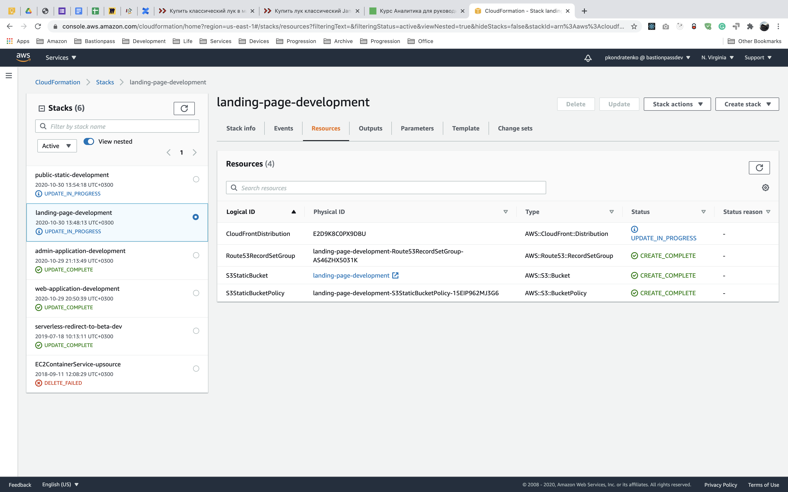
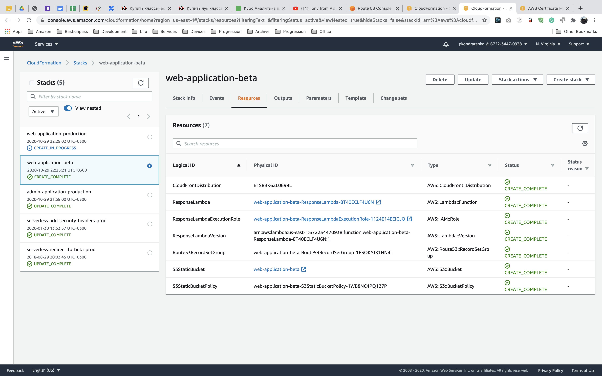

This collection of stacks is used to create stacks inside [AWS CloudFormation](https://console.aws.amazon.com/cloudformation/home) service.
These stacks are highly configurable via parameters fields what gives an ability to use every stack with custom setup.

## Environment health monitoring
#### [Dynamo database - Database usage monitor](monitoring/dynamo-database-usage-monitor.yml)
Creat alarms to watch for dynamo resources usage.

#### [Elastic beanstalk - Environment health alarms](monitoring/elastic-beanstalk-environment-health-monitor.yml)
Create alarms to report about elastic beanstalk environment health degradation.

#### [Elastic cache - Redis cluster usage alarms](monitoring/elastic-cache-redis-cluster-health-monitor.yml)
Create alarms to report about redis cluster issues.

#### [Elastic compute cloud - Auto scaling group resources alarms](monitoring/elastic-compute-cloud-auto-scaling-group-resources-monitor.yml)
Create alarms to report issues with instances connected to particular ec2 auto-scaling group.

#### [Elastic compute cloud - Target group anomaly detection](monitoring/elastic-compute-cloud-target-group-anomaly-monitor.yml)
Create alarms to report anomalies detections from elastic compute cloud service.

#### [Lambda - Errors monitor](monitoring/lambda-errors-monitor.yml)
Create alarms to watch for all lambdas errors and report about them to sns topic.

#### [Relative database storage - Postgresql health monitor](monitoring/elastic-compute-cloud-target-group-anomaly-monitor.yml)
Create alarms to keep an eye on postgres database health.

#### [Simple storage - Static bucket monitor](monitoring/simple-storage-static-bucket-monitor.yml)
Create alarms to watch for static bucket size which should be below the limit. 

### Tools
#### [Public static bucket](./tools/public-static-bucket.yml)
Serve static files from a bucket without any spa behaviours.
See example on [gustarus.com](https://gustarus.com).

#### [Single page bucket application](./tools/single-page-bucket-application.yml)
Stack to launch single page applications which being served from a public bucket.
See example on [app.gustarus.com](https://app.gustarus.com).

**Deploy changes in the lambda code and invalidate cloud front distribution**
When you make changes in the lambda or change parameters which change the lambda, you have to publish new version of the lambda and use it in the cloud front distribution.
1. Change the lambda code in the template.
2. Update cloud front stack with the new template.
3. Deploy new cloud front stack with the updated lambda code.
4. From the lambda resource page go to `Actions` → `Publish new version` → `Publish`.
5. Increase lambda version in the cloud front stack parameters.
6. Deploy updated stack with updated lambda version.

